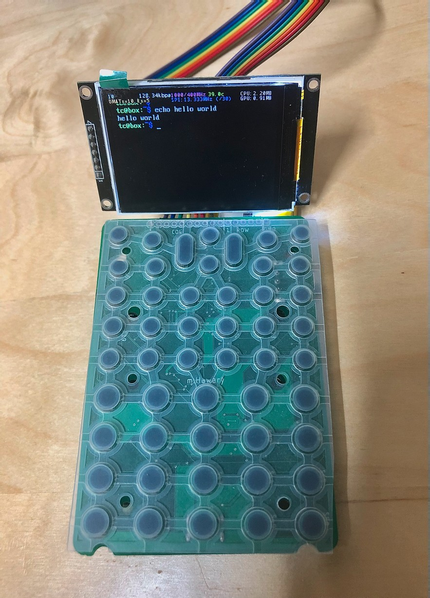
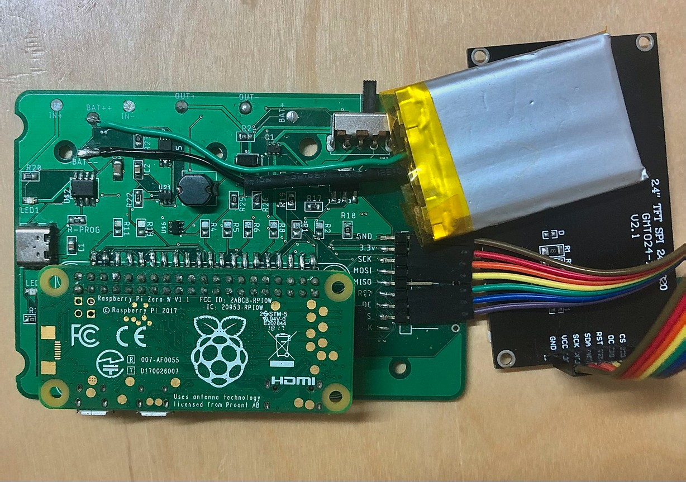
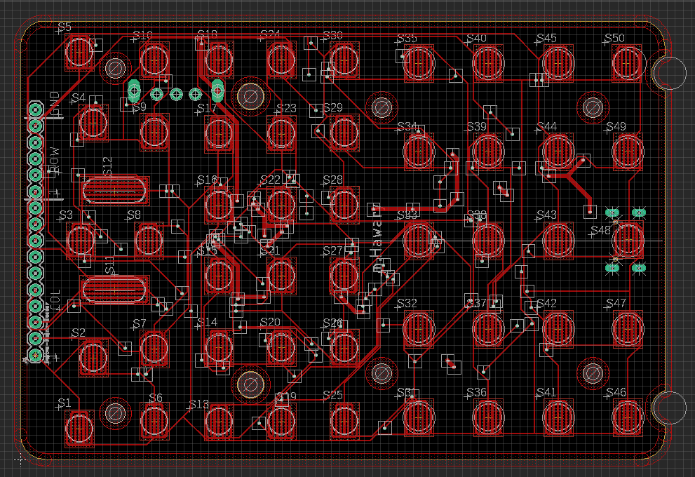
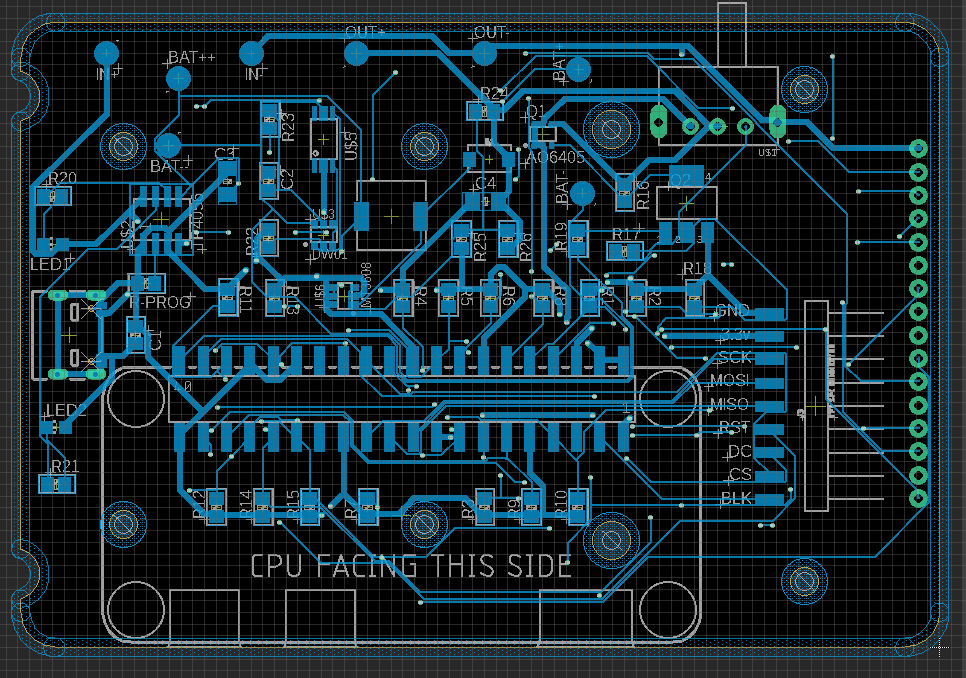

# RPi Calculator
A work-in-progress prototype for a Raspberry Pi-based calculator/small portable computer.
This project aims to give the power of Linux and Python programming in a small and portable form-factor.

Currently, it's still in the prototyping stage. The Raspberry Pi runs on PiCore: a very lightweight Linux distro that surprisingly still has lots of functionalitites.

This project was my first attempt to use Autodesk EAGLE.

## Features:
* Poweroff switch that sends a signal for the OS to fully shut down then disconnects power from the RPi.
* LiPo battery-operated and uses a USB-C connector for charging.
* Pins at the top of the PCB to use it as a button matrix for other projects.
* Can use practically any small SPI display (the display is connected using a ribbon connector separate from the main PCB).
* Ability to easily change between different Raspberry Pi models.

## Current Prototype:

(The terminal command was written entirely using the onboard buttons).

Pictures of the PCB design from Autodesk EAGLE:

